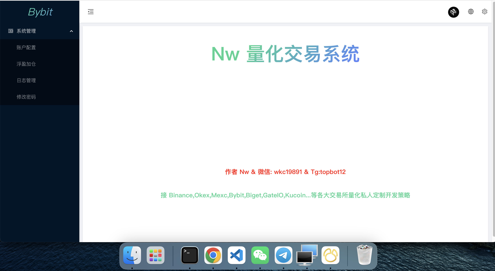

# Node.js & JavaScript SDK for Binance REST APIs & WebSockets

## 策略定制联系作者

## Installation

`npm install binance-api-nw`

## Examples

Refer to the [examples](./examples) folder for implementation demos.

## Documentation

Most methods accept JS objects. These can be populated using parameters specified by Binance's API documentation.

- [Binance API Documentation](https://developers.binance.com/docs)

  - [ Spot ](https://developers.binance.com/docs/binance-spot-api-docs)
  - [ Derivatives ](https://developers.binance.com/docs/derivatives)
  - [ Margin ](https://developers.binance.com/docs/margin_trading)
  - [ Wallet ](https://developers.binance.com/docs/wallet)

- [Find all products here](https://developers.binance.com/en)

- [REST Endpoint Function List](./docs/endpointFunctionList.md)
- [TSDoc Documentation (autogenerated using typedoc)](https://tsdocs.dev/docs/binance)

## Structure

This project uses typescript. Resources are stored in 3 key structures:

- [src](./src) - the whole connector written in typescript
- [lib](./lib) - the javascript version of the project (compiled from typescript). This should not be edited directly, as it will be overwritten with each release.
- [dist](./dist) - the packed bundle of the project for use in browser environments.

---

# Usage

Create API credentials at Binance

- [Livenet](https://www.binance.com/en/support/faq/360002502072?ref=IVRLUZJO)

## REST API Clients

There are several REST API modules as there are some differences in each API group.

1. `MainClient` for most APIs, including: spot, margin, isolated margin, mining, BLVT, BSwap, Fiat & sub-account management.
2. `USDMClient` for USD-M futures APIs.
3. `CoinMClient` for COIN-M futures APIs.

Vanilla Options connectors are not yet available, though contributions are welcome!

### REST Spot/Margin/etc

Start by importing the spot client. API credentials are optional, though an error is thrown when attempting any private API calls without credentials.

```javascript
const { MainClient } = require('binance-api-nw');

const API_KEY = 'xxx';
const API_SECRET = 'yyy';

const client = new MainClient({
  api_key: API_KEY,
  api_secret: API_SECRET,
});

client
  .getAccountTradeList({ symbol: 'BTCUSDT' })
  .then((result) => {
    console.log('getAccountTradeList result: ', result);
  })
  .catch((err) => {
    console.error('getAccountTradeList error: ', err);
  });

client
  .getExchangeInfo()
  .then((result) => {
    console.log('getExchangeInfo inverse result: ', result);
  })
  .catch((err) => {
    console.error('getExchangeInfo inverse error: ', err);
  });
```

See [spot-client.ts](./src/main-client.ts) for further information.

### REST USD-M Futures

Start by importing the usd-m client. API credentials are optional, though an error is thrown when attempting any private API calls without credentials.

```javascript
const { USDMClient } = require('binance-api-nw');

const API_KEY = 'xxx';
const API_SECRET = 'yyy';

const client = new USDMClient({
  api_key: API_KEY,
  api_secret: API_SECRET,
});

client
  .getBalance()
  .then((result) => {
    console.log('getBalance result: ', result);
  })
  .catch((err) => {
    console.error('getBalance error: ', err);
  });

client
  .get24hrChangeStatististics()
  .then((result) => {
    console.log('get24hrChangeStatististics inverse futures result: ', result);
  })
  .catch((err) => {
    console.error('get24hrChangeStatististics inverse futures error: ', err);
  });
```

See [usdm-client.ts](./src/usdm-client.ts) for further information.

### REST COIN-M Futures

Start by importing the coin-m client. API credentials are optional, though an error is thrown when attempting any private API calls without credentials.

```javascript
const { CoinMClient } = require('binance-api-nw');

const API_KEY = 'xxx';
const API_SECRET = 'yyy';

const client = new CoinMClient({
  api_key: API_KEY,
  api_secret: API_SECRET,
});

client
  .getSymbolOrderBookTicker()
  .then((result) => {
    console.log('getSymbolOrderBookTicker result: ', result);
  })
  .catch((err) => {
    console.error('getSymbolOrderBookTicker error: ', err);
  });
```

See [coinm-client.ts](./src/coinm-client.ts) for further information.

## WebSockets

All websockets are accessible via the shared `WebsocketClient`. As before, API credentials are optional unless the user data stream is required.

```javascript
const { WebsocketClient } = require('binance-api-nw');

const API_KEY = 'xxx';
const API_SECRET = 'yyy';

// optionally override the logger
const logger = {
  ...DefaultLogger,
  silly: (...params) => {},
};

const wsClient = new WebsocketClient(
  {
    api_key: key,
    api_secret: secret,
    beautify: true,
    // Disable ping/pong ws heartbeat mechanism (not recommended)
    // disableHeartbeat: true
  },
  logger,
);

// receive raw events
wsClient.on('message', (data) => {
  console.log('raw message received ', JSON.stringify(data, null, 2));
});

// notification when a connection is opened
wsClient.on('open', (data) => {
  console.log('connection opened open:', data.wsKey, data.ws.target.url);
});

// receive formatted events with beautified keys. Any "known" floats stored in strings as parsed as floats.
wsClient.on('formattedMessage', (data) => {
  console.log('formattedMessage: ', data);
});

// read response to command sent via WS stream (e.g LIST_SUBSCRIPTIONS)
wsClient.on('reply', (data) => {
  console.log('log reply: ', JSON.stringify(data, null, 2));
});

// receive notification when a ws connection is reconnecting automatically
wsClient.on('reconnecting', (data) => {
  console.log('ws automatically reconnecting.... ', data?.wsKey);
});

// receive notification that a reconnection completed successfully (e.g use REST to check for missing data)
wsClient.on('reconnected', (data) => {
  console.log('ws has reconnected ', data?.wsKey);
});

// Recommended: receive error events (e.g. first reconnection failed)
wsClient.on('error', (data) => {
  console.log('ws saw error ', data?.wsKey);
});

// Call methods to subcribe to as many websockets as you want.
// Each method spawns a new connection, unless a websocket already exists for that particular request topic.
// wsClient.subscribeSpotAggregateTrades(market);
// wsClient.subscribeSpotTrades(market);
// wsClient.subscribeSpotKline(market, interval);
// wsClient.subscribeSpotSymbolMini24hrTicker(market);
// wsClient.subscribeSpotAllMini24hrTickers();
// wsClient.subscribeSpotSymbol24hrTicker(market);
// wsClient.subscribeSpotAll24hrTickers();
// wsClient.subscribeSpotSymbolBookTicker(market);
// wsClient.subscribeSpotAllBookTickers();
// wsClient.subscribeSpotPartialBookDepth(market, 5);
// wsClient.subscribeSpotDiffBookDepth(market);

wsClient.subscribeSpotUserDataStream();
wsClient.subscribeMarginUserDataStream();
wsClient.subscribeIsolatedMarginUserDataStream('BTCUSDT');

wsClient.subscribeUsdFuturesUserDataStream();

// each method also restores the WebSocket object, which can be interacted with for more control
// const ws1 = wsClient.subscribeSpotSymbolBookTicker(market);
// const ws2 = wsClient.subscribeSpotAllBookTickers();
// const ws3 = wsClient.subscribeSpotUserDataStream(listenKey);

// optionally directly open a connection to a URL. Not recommended for production use.
// const ws4 = wsClient.connectToWsUrl(`wss://stream.binance.com:9443/ws/${listenKey}`, 'customDirectWsConnection1');
```

See [websocket-client.ts](./src/websocket-client.ts) for further information. Also see [ws-userdata.ts](./examples/ws-userdata.ts) for user data examples.

---

## Customise Logging

Pass a custom logger which supports the log methods `silly`, `debug`, `notice`, `info`, `warning` and `error`, or override methods from the default logger as desired.

```javascript
const { WebsocketClient, DefaultLogger } = require('binance-api-nw');

// Enable all logging on the silly level
DefaultLogger.silly = (...params) => {
  console.log('sillyLog: ', params);
};

const ws = new WebsocketClient(
  api_key: 'xxx',
  api_secret: 'yyyy',
  DefaultLogger
);
```

## Browser/Frontend Usage

### Import

This is the "modern" way, allowing the package to be directly imported into frontend projects with full typescript support.

1. Install these dependencies
   ```sh
   npm install crypto-browserify stream-browserify
   ```
2. Add this to your `tsconfig.json`
   ```json
   {
     "compilerOptions": {
       "paths": {
         "crypto": [
           "./node_modules/crypto-browserify"
         ],
         "stream": [
           "./node_modules/stream-browserify"
         ]
   }
   ```
3. Declare this in the global context of your application (ex: in polyfills for angular)
   ```js
   (window as any).global = window;
   ```

### Webpack

This is the "old" way of using this package on webpages. This will build a minified js bundle that can be pulled in using a script tag on a website.

Build a bundle using webpack:

- `npm install`
- `npm build`
- `npm pack`

The bundle can be found in `dist/`. Altough usage should be largely consistent, smaller differences will exist. Documentation is still TODO.

However, note that browser usage will lead to CORS errors due to Binance.

---

<!-- template_contributions -->

### Contributions & Thanks

Have my projects helped you? Share the love, there are many ways you can show your thanks:

- Star & share my projects.
- Are my projects useful? Sponsor me on Github and support my effort to maintain & improve them: https://github.com/sponsors/tiagosiebler
- Have an interesting project? Get in touch & invite me to it.
- Or buy me all the coffee:
  - ETH(ERC20): `0xA3Bda8BecaB4DCdA539Dc16F9C54a592553Be06C` <!-- metamask -->

<!---
old ones:
  - BTC: `1C6GWZL1XW3jrjpPTS863XtZiXL1aTK7Jk`
  - BTC(SegWit): `bc1ql64wr9z3khp2gy7dqlmqw7cp6h0lcusz0zjtls`
  - ETH(ERC20): `0xe0bbbc805e0e83341fadc210d6202f4022e50992`
  - USDT(TRC20): `TA18VUywcNEM9ahh3TTWF3sFpt9rkLnnQa
-->
<!-- template_contributions_end -->

### Contributions & Pull Requests

Contributions are encouraged, I will review any incoming pull requests. See the issues tab for todo items.

<!-- template_star_history -->

## Star History

[](https://star-history.com/#tiagosiebler/bybit-api&tiagosiebler/okx-api&tiagosiebler/binance&tiagosiebler/bitget-api&tiagosiebler/bitmart-api&tiagosiebler/gateio-api&tiagosiebler/kucoin-api&tiagosiebler/coinbase-api&tiagosiebler/orderbooks&tiagosiebler/accountstate&tiagosiebler/awesome-crypto-examples&Date)

<!-- template_star_history_end -->
